> ⚠️ **退役说明**：本文引用的 `engine/src/db/`（PostgreSQL 风格 CMake 内核）已于 **2026-11-18 退役**，源码、公开头与测试全部删除；文中出现的 `engine/src/db/...`、`engine/include/db/...`、`engine/test/db/...` 路径均为**历史路径**，现已不存在。
> 当前唯一数据库内核是 `engine/db/`。

# db 数据库存储引擎 - 过程视图

## 概述

本文档描述 db 数据库存储引擎的过程视图，展示系统的运行时行为、并发模型和核心流程。

---

## 一、系统启动流程

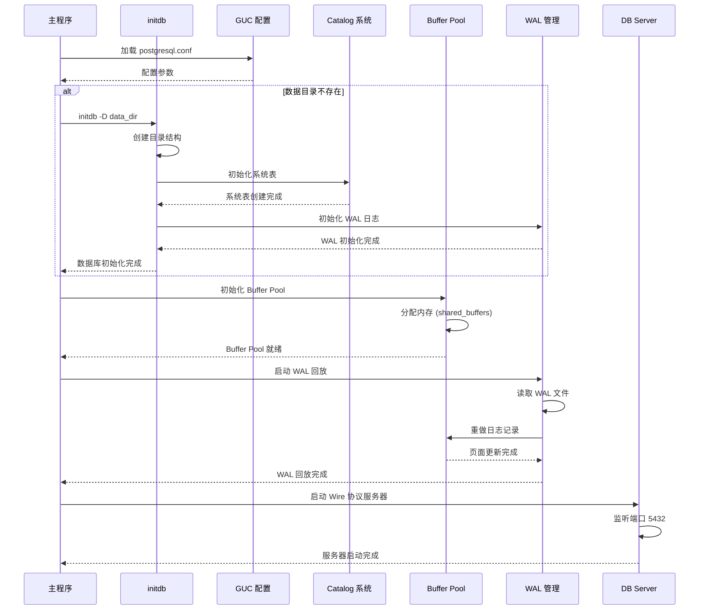
```mermaid
sequenceDiagram
    participant Main as 主程序
    participant InitDB as initdb
    participant GUC as GUC 配置
    participant Catalog as Catalog 系统
    participant BufMgr as Buffer Pool
    participant WAL as WAL 管理
    participant Server as DB Server

    Main->>GUC: 加载 postgresql.conf
    GUC-->>Main: 配置参数

    alt 数据目录不存在
        Main->>InitDB: initdb -D data_dir
        InitDB->>InitDB: 创建目录结构
        InitDB->>Catalog: 初始化系统表
        Catalog-->>InitDB: 系统表创建完成
        InitDB->>WAL: 初始化 WAL 日志
        WAL-->>InitDB: WAL 初始化完成
        InitDB-->>Main: 数据库初始化完成
    end

    Main->>BufMgr: 初始化 Buffer Pool
    BufMgr->>BufMgr: 分配内存 (shared_buffers)
    BufMgr-->>Main: Buffer Pool 就绪

    Main->>WAL: 启动 WAL 回放
    WAL->>WAL: 读取 WAL 文件
    WAL->>BufMgr: 重做日志记录
    BufMgr-->>WAL: 页面更新完成
    WAL-->>Main: WAL 回放完成

    Main->>Server: 启动 Wire 协议服务器
    Server->>Server: 监听端口 5432
    Server-->>Main: 服务器启动完成
```

---

## 二、查询执行流程

### 2.1 SQL 查询完整流程

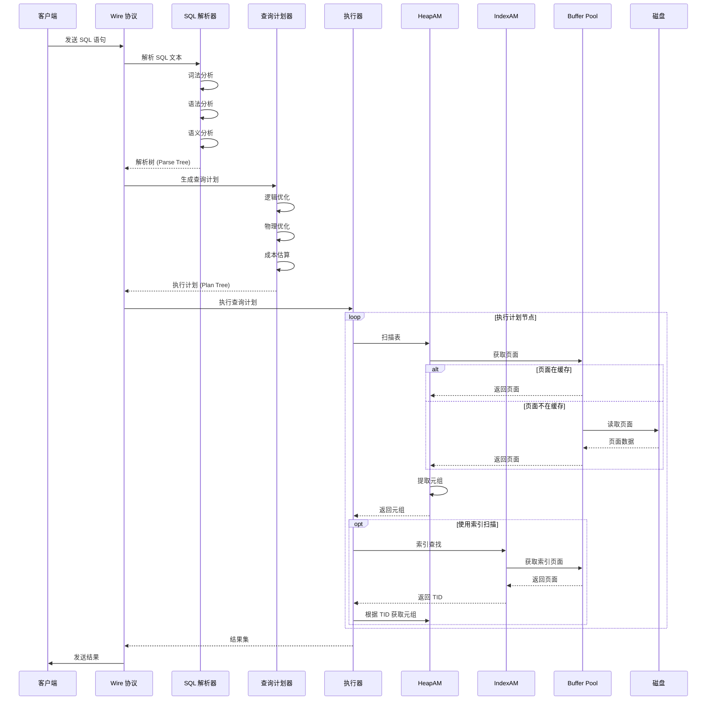
```mermaid
sequenceDiagram
    participant Client as 客户端
    participant Server as Wire 协议
    participant Parser as SQL 解析器
    participant Planner as 查询计划器
    participant Executor as 执行器
    participant HeapAM as HeapAM
    participant IndexAM as IndexAM
    participant BufPool as Buffer Pool
    participant Disk as 磁盘

    Client->>Server: 发送 SQL 语句
    Server->>Parser: 解析 SQL 文本
    Parser->>Parser: 词法分析
    Parser->>Parser: 语法分析
    Parser->>Parser: 语义分析
    Parser-->>Server: 解析树 (Parse Tree)

    Server->>Planner: 生成查询计划
    Planner->>Planner: 逻辑优化
    Planner->>Planner: 物理优化
    Planner->>Planner: 成本估算
    Planner-->>Server: 执行计划 (Plan Tree)

    Server->>Executor: 执行查询计划

    loop 执行计划节点
        Executor->>HeapAM: 扫描表
        HeapAM->>BufPool: 获取页面

        alt 页面在缓存
            BufPool-->>HeapAM: 返回页面
        else 页面不在缓存
            BufPool->>Disk: 读取页面
            Disk-->>BufPool: 页面数据
            BufPool-->>HeapAM: 返回页面
        end

        HeapAM->>HeapAM: 提取元组
        HeapAM-->>Executor: 返回元组

        opt 使用索引扫描
            Executor->>IndexAM: 索引查找
            IndexAM->>BufPool: 获取索引页面
            BufPool-->>IndexAM: 返回页面
            IndexAM-->>Executor: 返回 TID
            Executor->>HeapAM: 根据 TID 获取元组
        end
    end

    Executor-->>Server: 结果集
    Server->>Client: 发送结果
```

### 2.2 INSERT 语句执行流程

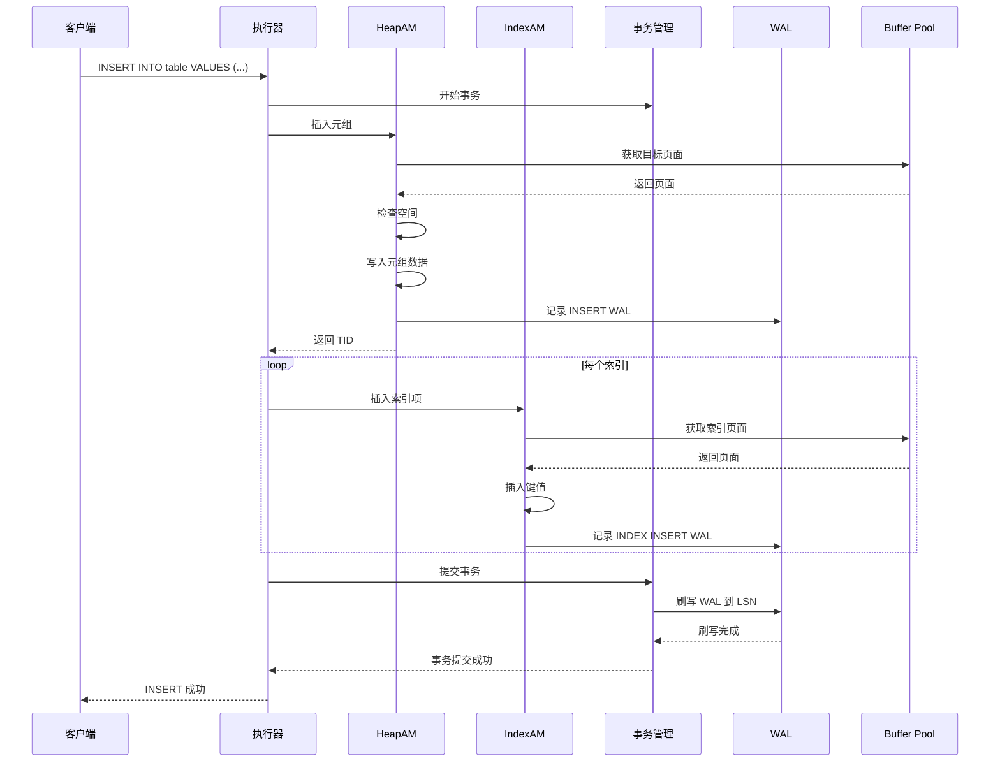
```mermaid
sequenceDiagram
    participant Client as 客户端
    participant Executor as 执行器
    participant HeapAM as HeapAM
    participant IndexAM as IndexAM
    participant TXN as 事务管理
    participant WAL as WAL
    participant BufPool as Buffer Pool

    Client->>Executor: INSERT INTO table VALUES (...)
    Executor->>TXN: 开始事务

    Executor->>HeapAM: 插入元组
    HeapAM->>BufPool: 获取目标页面
    BufPool-->>HeapAM: 返回页面
    HeapAM->>HeapAM: 检查空间
    HeapAM->>HeapAM: 写入元组数据
    HeapAM->>WAL: 记录 INSERT WAL
    HeapAM-->>Executor: 返回 TID

    loop 每个索引
        Executor->>IndexAM: 插入索引项
        IndexAM->>BufPool: 获取索引页面
        BufPool-->>IndexAM: 返回页面
        IndexAM->>IndexAM: 插入键值
        IndexAM->>WAL: 记录 INDEX INSERT WAL
    end

    Executor->>TXN: 提交事务
    TXN->>WAL: 刷写 WAL 到 LSN
    WAL-->>TXN: 刷写完成
    TXN-->>Executor: 事务提交成功
    Executor-->>Client: INSERT 成功
```

### 2.3 UPDATE 语句执行流程

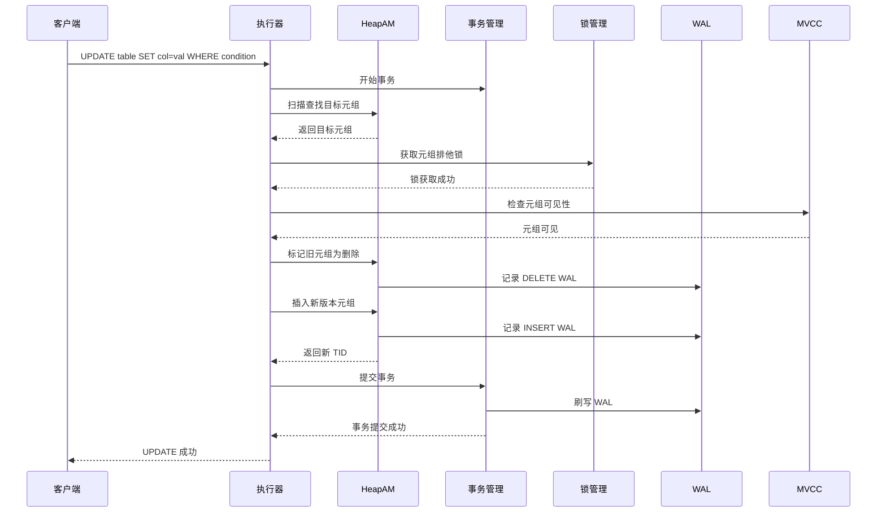
```mermaid
sequenceDiagram
    participant Client as 客户端
    participant Executor as 执行器
    participant HeapAM as HeapAM
    participant TXN as 事务管理
    participant Lock as 锁管理
    participant WAL as WAL
    participant MVCC as MVCC

    Client->>Executor: UPDATE table SET col=val WHERE condition
    Executor->>TXN: 开始事务

    Executor->>HeapAM: 扫描查找目标元组
    HeapAM-->>Executor: 返回目标元组

    Executor->>Lock: 获取元组排他锁
    Lock-->>Executor: 锁获取成功

    Executor->>MVCC: 检查元组可见性
    MVCC-->>Executor: 元组可见

    Executor->>HeapAM: 标记旧元组为删除
    HeapAM->>WAL: 记录 DELETE WAL

    Executor->>HeapAM: 插入新版本元组
    HeapAM->>WAL: 记录 INSERT WAL
    HeapAM-->>Executor: 返回新 TID

    Executor->>TXN: 提交事务
    TXN->>WAL: 刷写 WAL
    TXN-->>Executor: 事务提交成功
    Executor-->>Client: UPDATE 成功
```

---

## 三、Buffer Pool 并发模型

### 3.1 页面获取流程

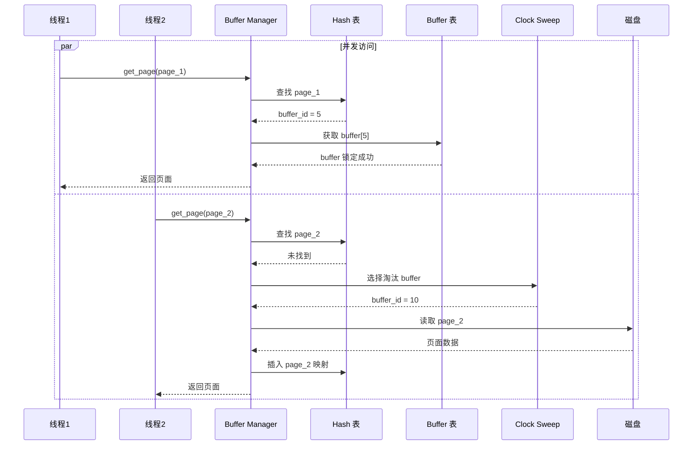
```mermaid
sequenceDiagram
    participant Thread1 as 线程1
    participant Thread2 as 线程2
    participant BufMgr as Buffer Manager
    participant HashTab as Hash 表
    participant BufTab as Buffer 表
    participant Clock as Clock Sweep
    participant Disk as 磁盘

    par 并发访问
        Thread1->>BufMgr: get_page(page_1)
        BufMgr->>HashTab: 查找 page_1
        HashTab-->>BufMgr: buffer_id = 5
        BufMgr->>BufTab: 获取 buffer[5]
        BufTab-->>BufMgr: buffer 锁定成功
        BufMgr-->>Thread1: 返回页面
    and
        Thread2->>BufMgr: get_page(page_2)
        BufMgr->>HashTab: 查找 page_2
        HashTab-->>BufMgr: 未找到
        BufMgr->>Clock: 选择淘汰 buffer
        Clock-->>BufMgr: buffer_id = 10
        BufMgr->>Disk: 读取 page_2
        Disk-->>BufMgr: 页面数据
        BufMgr->>HashTab: 插入 page_2 映射
        BufMgr-->>Thread2: 返回页面
    end
```

### 3.2 Clock-Sweep 置换算法流程

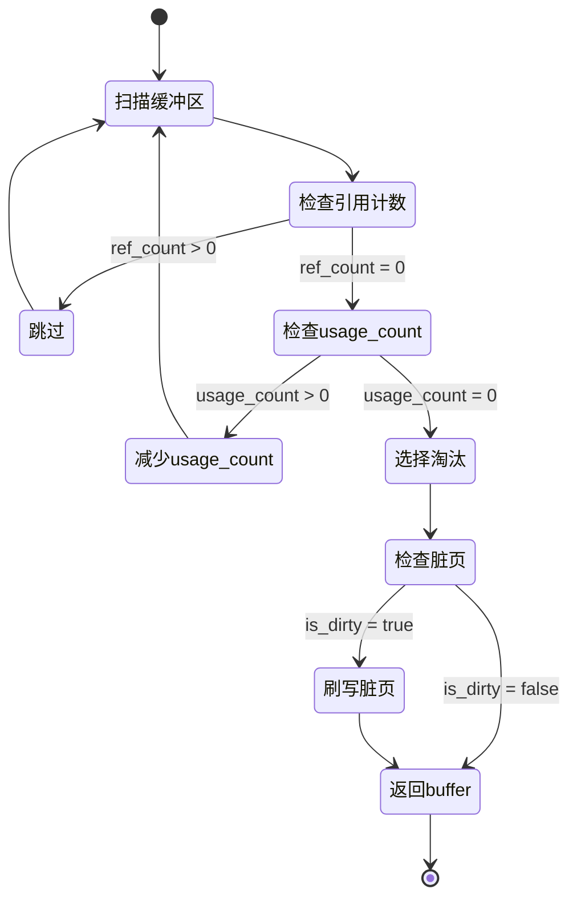
```mermaid
stateDiagram-v2
    [*] --> 扫描缓冲区
    扫描缓冲区 --> 检查引用计数
    检查引用计数 --> 跳过: ref_count > 0
    检查引用计数 --> 检查usage_count: ref_count = 0
    跳过 --> 扫描缓冲区
    检查usage_count --> 减少usage_count: usage_count > 0
    检查usage_count --> 选择淘汰: usage_count = 0
    减少usage_count --> 扫描缓冲区
    选择淘汰 --> 检查脏页
    检查脏页 --> 刷写脏页: is_dirty = true
    检查脏页 --> 返回buffer: is_dirty = false
    刷写脏页 --> 返回buffer
    返回buffer --> [*]
```

---

## 四、事务并发控制

### 4.1 事务生命周期

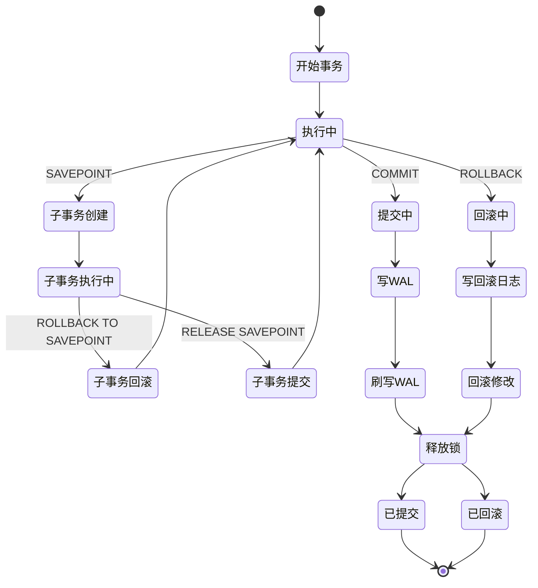
```mermaid
stateDiagram-v2
    [*] --> 开始事务
    开始事务 --> 执行中
    执行中 --> 子事务创建: SAVEPOINT
    子事务创建 --> 子事务执行中
    子事务执行中 --> 子事务回滚: ROLLBACK TO SAVEPOINT
    子事务执行中 --> 子事务提交: RELEASE SAVEPOINT
    子事务回滚 --> 执行中
    子事务提交 --> 执行中
    执行中 --> 提交中: COMMIT
    执行中 --> 回滚中: ROLLBACK
    提交中 --> 写WAL
    写WAL --> 刷写WAL
    刷写WAL --> 释放锁
    释放锁 --> 已提交
    回滚中 --> 写回滚日志
    写回滚日志 --> 回滚修改
    回滚修改 --> 释放锁
    释放锁 --> 已回滚
    已提交 --> [*]
    已回滚 --> [*]
```

### 4.2 MVCC 可见性判断流程

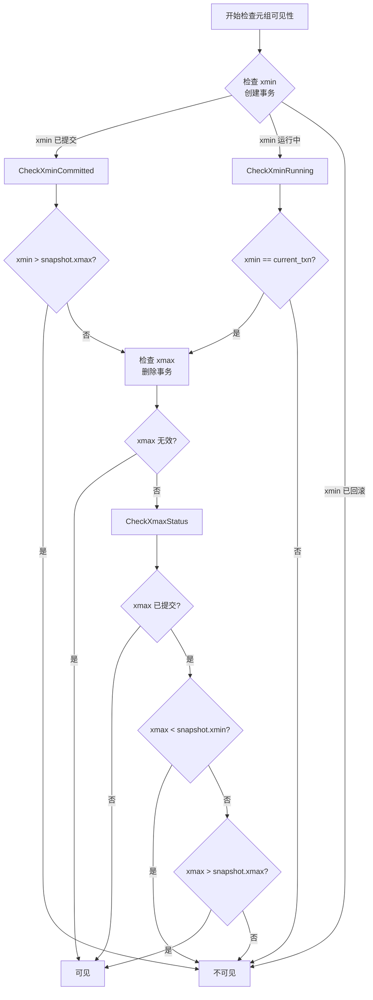
```mermaid
flowchart TD
    Start[开始检查元组可见性] --> CheckXmin{检查 xmin<br/>创建事务}
    CheckXmin -->|xmin 已提交| CheckXminCommitted
    CheckXmin -->|xmin 运行中| CheckXminRunning
    CheckXmin -->|xmin 已回滚| NotVisible[不可见]

    CheckXminCommitted --> CheckXminAfterSnapshot{xmin > snapshot.xmax?}
    CheckXminAfterSnapshot -->|是| NotVisible
    CheckXminAfterSnapshot -->|否| CheckXmax

    CheckXminRunning --> CheckXminIsCurrent{xmin == current_txn?}
    CheckXminIsCurrent -->|是| CheckXmax
    CheckXminIsCurrent -->|否| NotVisible

    CheckXmax[检查 xmax<br/>删除事务] --> CheckXmaxNull{xmax 无效?}
    CheckXmaxNull -->|是| Visible[可见]
    CheckXmaxNull -->|否| CheckXmaxStatus

    CheckXmaxStatus --> CheckXmaxCommitted{xmax 已提交?}
    CheckXmaxCommitted -->|否| Visible
    CheckXmaxCommitted -->|是| CheckXmaxBeforeSnapshot{xmax < snapshot.xmin?}

    CheckXmaxBeforeSnapshot -->|是| NotVisible
    CheckXmaxBeforeSnapshot -->|否| CheckXmaxAfterSnapshot{xmax > snapshot.xmax?}

    CheckXmaxAfterSnapshot -->|是| Visible
    CheckXmaxAfterSnapshot -->|否| NotVisible
```

### 4.3 锁等待流程

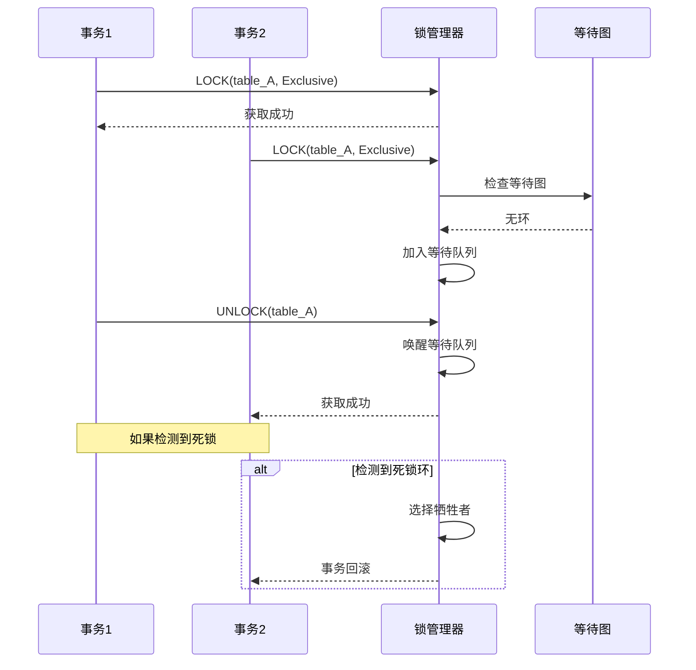
```mermaid
sequenceDiagram
    participant T1 as 事务1
    participant T2 as 事务2
    participant LockMgr as 锁管理器
    participant WaitGraph as 等待图

    T1->>LockMgr: LOCK(table_A, Exclusive)
    LockMgr-->>T1: 获取成功

    T2->>LockMgr: LOCK(table_A, Exclusive)
    LockMgr->>WaitGraph: 检查等待图
    WaitGraph-->>LockMgr: 无环
    LockMgr->>LockMgr: 加入等待队列

    T1->>LockMgr: UNLOCK(table_A)
    LockMgr->>LockMgr: 唤醒等待队列
    LockMgr-->>T2: 获取成功

    Note over T1,T2: 如果检测到死锁
    alt 检测到死锁环
        LockMgr->>LockMgr: 选择牺牲者
        LockMgr-->>T2: 事务回滚
    end
```

---

## 五、WAL 日志流程

### 5.1 WAL 写入流程

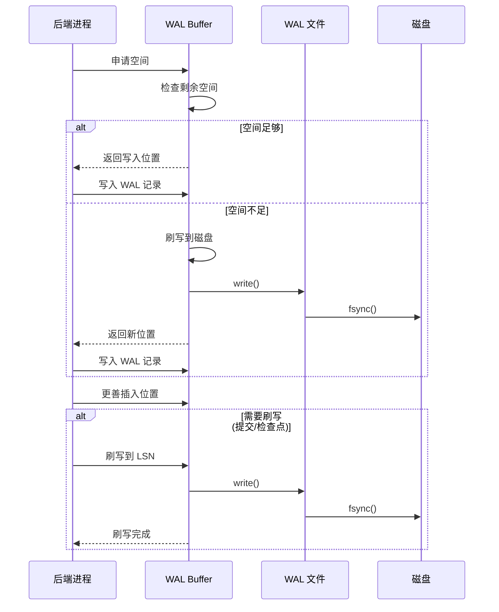
```mermaid
sequenceDiagram
    participant Backend as 后端进程
    participant WALBuf as WAL Buffer
    participant WALFile as WAL 文件
    participant Disk as 磁盘

    Backend->>WALBuf: 申请空间
    WALBuf->>WALBuf: 检查剩余空间

    alt 空间足够
        WALBuf-->>Backend: 返回写入位置
        Backend->>WALBuf: 写入 WAL 记录
    else 空间不足
        WALBuf->>WALBuf: 刷写到磁盘
        WALBuf->>WALFile: write()
        WALFile->>Disk: fsync()
        WALBuf-->>Backend: 返回新位置
        Backend->>WALBuf: 写入 WAL 记录
    end

    Backend->>WALBuf: 更善插入位置

    alt 需要刷写 (提交/检查点)
        Backend->>WALBuf: 刷写到 LSN
        WALBuf->>WALFile: write()
        WALFile->>Disk: fsync()
        WALBuf-->>Backend: 刷写完成
    end
```

### 5.2 检查点流程

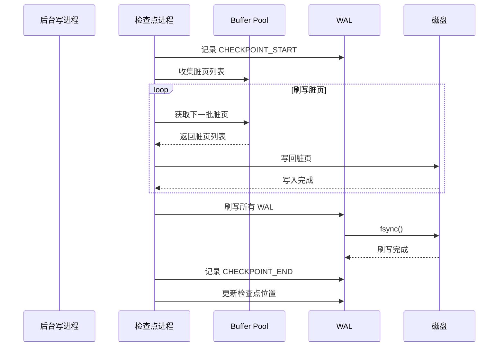
```mermaid
sequenceDiagram
    participant BGWriter as 后台写进程
    participant CheckPoint as 检查点进程
    participant BufPool as Buffer Pool
    participant WAL as WAL
    participant Disk as 磁盘

    CheckPoint->>WAL: 记录 CHECKPOINT_START
    CheckPoint->>BufPool: 收集脏页列表

    loop 刷写脏页
        CheckPoint->>BufPool: 获取下一批脏页
        BufPool-->>CheckPoint: 返回脏页列表
        CheckPoint->>Disk: 写回脏页
        Disk-->>CheckPoint: 写入完成
    end

    CheckPoint->>WAL: 刷写所有 WAL
    WAL->>Disk: fsync()
    Disk-->>WAL: 刷写完成

    CheckPoint->>WAL: 记录 CHECKPOINT_END
    CheckPoint->>WAL: 更新检查点位置
```

### 5.3 WAL 回放流程

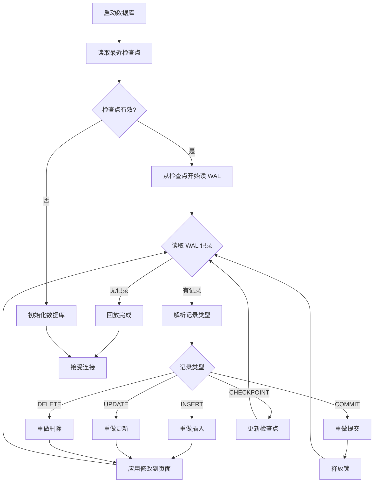
```mermaid
flowchart TD
    Start[启动数据库] --> ReadCheckpoint[读取最近检查点]
    ReadCheckpoint --> CheckValid{检查点有效?}
    CheckValid -->|是| ReadWAL[从检查点开始读 WAL]
    CheckValid -->|否| InitDB[初始化数据库]

    ReadWAL --> LoopRecords{读取 WAL 记录}
    LoopRecords -->|有记录| ParseRecord[解析记录类型]
    LoopRecords -->|无记录| Done[回放完成]

    ParseRecord --> CheckType{记录类型}
    CheckType -->|INSERT| RedoInsert[重做插入]
    CheckType -->|UPDATE| RedoUpdate[重做更新]
    CheckType -->|DELETE| RedoDelete[重做删除]
    CheckType -->|COMMIT| RedoCommit[重做提交]
    CheckType -->|CHECKPOINT| UpdateCheckpoint[更新检查点]

    RedoInsert --> ApplyChange[应用修改到页面]
    RedoUpdate --> ApplyChange
    RedoDelete --> ApplyChange
    RedoCommit --> ReleaseLocks[释放锁]
    ReleaseLocks --> LoopRecords
    ApplyChange --> LoopRecords
    UpdateCheckpoint --> LoopRecords
    Done --> OpenForConnections[接受连接]
    InitDB --> OpenForConnections
```

---

## 六、索引操作流程

### 6.1 BTree 索引插入流程

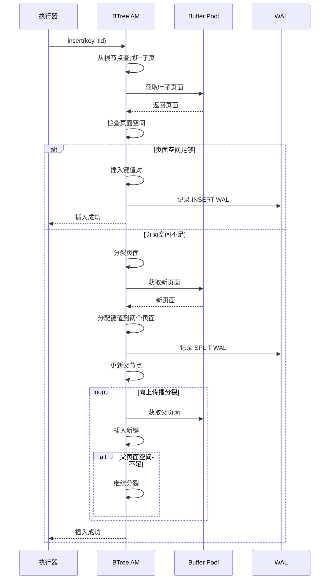
```mermaid
sequenceDiagram
    participant Executor as 执行器
    participant BTree as BTree AM
    participant BufPool as Buffer Pool
    participant WAL as WAL

    Executor->>BTree: insert(key, tid)
    BTree->>BTree: 从根节点查找叶子页
    BTree->>BufPool: 获取叶子页面
    BufPool-->>BTree: 返回页面

    BTree->>BTree: 检查页面空间

    alt 页面空间足够
        BTree->>BTree: 插入键值对
        BTree->>WAL: 记录 INSERT WAL
        BTree-->>Executor: 插入成功
    else 页面空间不足
        BTree->>BTree: 分裂页面
        BTree->>BufPool: 获取新页面
        BufPool-->>BTree: 新页面
        BTree->>BTree: 分配键值到两个页面
        BTree->>WAL: 记录 SPLIT WAL
        BTree->>BTree: 更新父节点
        loop 向上传播分裂
            BTree->>BufPool: 获取父页面
            BTree->>BTree: 插入新键
            alt 父页面空间不足
                BTree->>BTree: 继续分裂
            end
        end
        BTree-->>Executor: 插入成功
    end
```

### 6.2 向量索引 (HNSW) 搜索流程

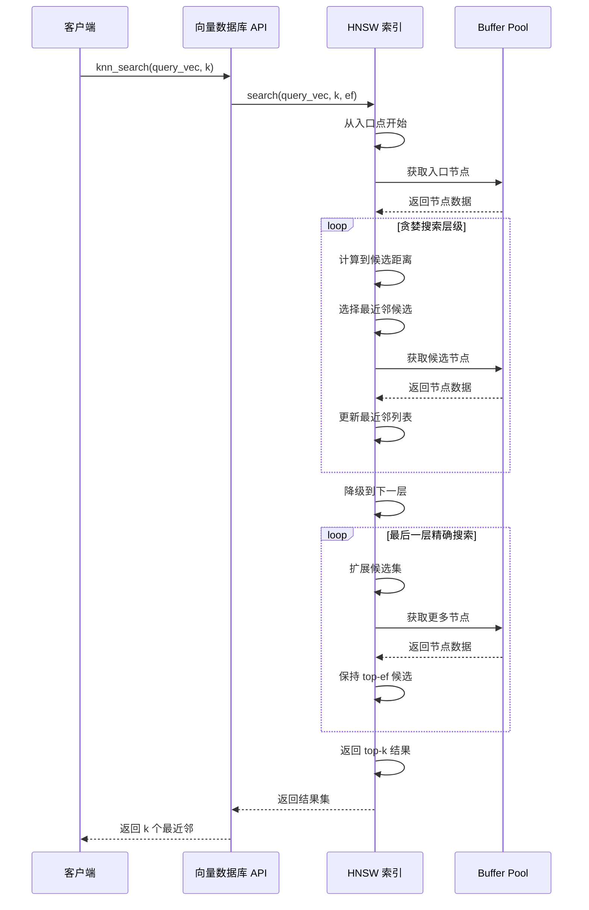
```mermaid
sequenceDiagram
    participant Client as 客户端
    participant VDB as 向量数据库 API
    participant HNSW as HNSW 索引
    participant BufPool as Buffer Pool

    Client->>VDB: knn_search(query_vec, k)
    VDB->>HNSW: search(query_vec, k, ef)

    HNSW->>HNSW: 从入口点开始
    HNSW->>BufPool: 获取入口节点
    BufPool-->>HNSW: 返回节点数据

    loop 贪婪搜索层级
        HNSW->>HNSW: 计算到候选距离
        HNSW->>HNSW: 选择最近邻候选
        HNSW->>BufPool: 获取候选节点
        BufPool-->>HNSW: 返回节点数据
        HNSW->>HNSW: 更新最近邻列表
    end

    HNSW->>HNSW: 降级到下一层

    loop 最后一层精确搜索
        HNSW->>HNSW: 扩展候选集
        HNSW->>BufPool: 获取更多节点
        BufPool-->>HNSW: 返回节点数据
        HNSW->>HNSW: 保持 top-ef 候选
    end

    HNSW->>HNSW: 返回 top-k 结果
    HNSW-->>VDB: 返回结果集
    VDB-->>Client: 返回 k 个最近邻
```

---

## 七、后台工作进程模型

### 7.1 bgworker 调度流程

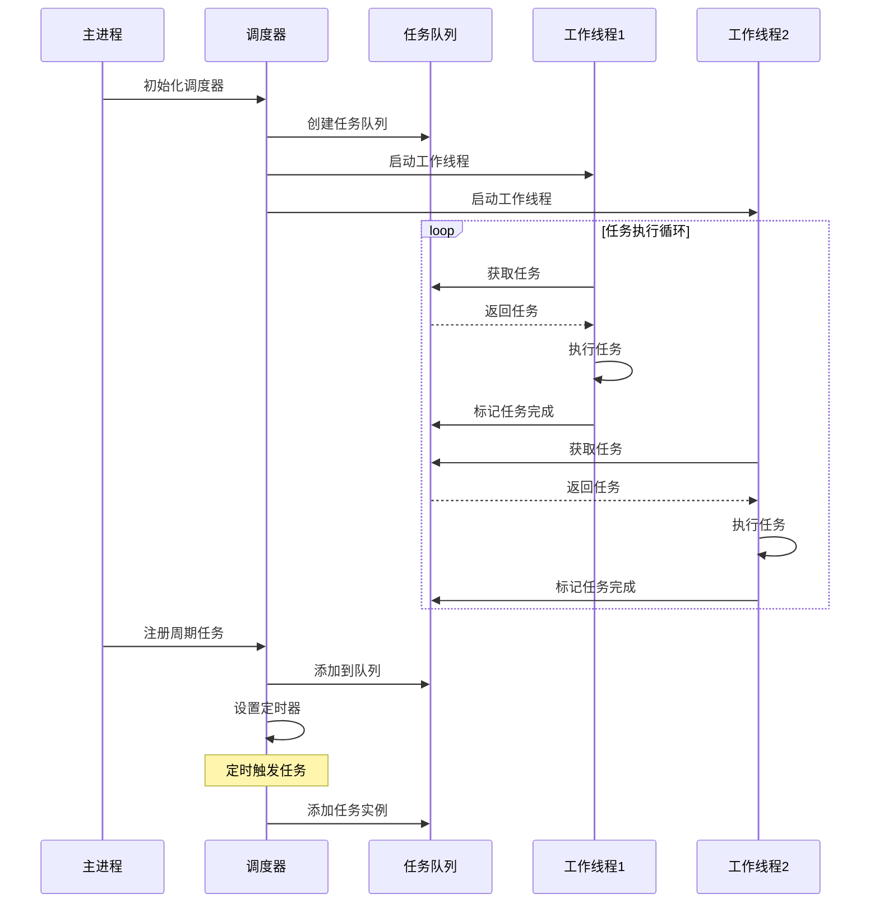
```mermaid
sequenceDiagram
    participant Main as 主进程
    participant Scheduler as 调度器
    participant Queue as 任务队列
    participant Worker1 as 工作线程1
    participant Worker2 as 工作线程2

    Main->>Scheduler: 初始化调度器
    Scheduler->>Queue: 创建任务队列
    Scheduler->>Worker1: 启动工作线程
    Scheduler->>Worker2: 启动工作线程

    loop 任务执行循环
        Worker1->>Queue: 获取任务
        Queue-->>Worker1: 返回任务
        Worker1->>Worker1: 执行任务
        Worker1->>Queue: 标记任务完成

        Worker2->>Queue: 获取任务
        Queue-->>Worker2: 返回任务
        Worker2->>Worker2: 执行任务
        Worker2->>Queue: 标记任务完成
    end

    Main->>Scheduler: 注册周期任务
    Scheduler->>Queue: 添加到队列
    Scheduler->>Scheduler: 设置定时器

    Note over Scheduler: 定时触发任务
    Scheduler->>Queue: 添加任务实例
```

### 7.2 统计收集任务流程

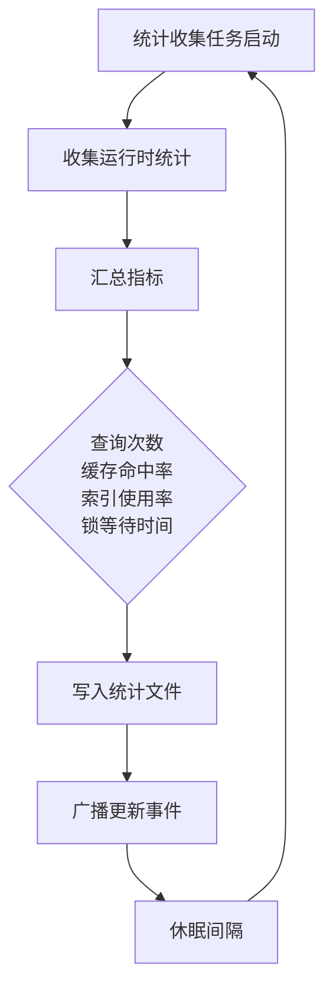
```mermaid
flowchart TD
    Start[统计收集任务启动] --> CollectStats[收集运行时统计]
    CollectStats --> GatherMetrics[汇总指标]
    GatherMetrics --> Metrics{
        查询次数
        缓存命中率
        索引使用率
        锁等待时间
    }
    Metrics --> WriteStats[写入统计文件]
    WriteStats --> BroadcastUpdate[广播更新事件]
    BroadcastUpdate --> Sleep[休眠间隔]
    Sleep --> Start
```

---

## 八、连接处理流程

### 8.1 Wire 协议连接建立

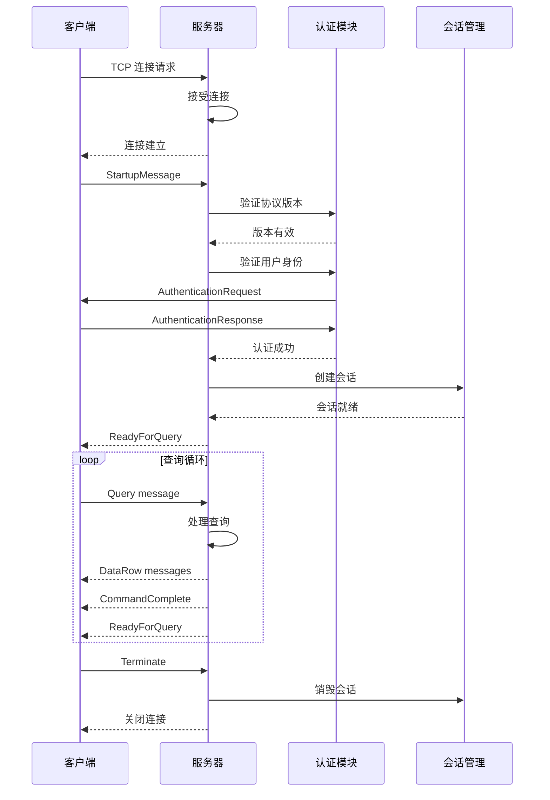
```mermaid
sequenceDiagram
    participant Client as 客户端
    participant Server as 服务器
    participant Auth as 认证模块
    participant Session as 会话管理

    Client->>Server: TCP 连接请求
    Server->>Server: 接受连接
    Server-->>Client: 连接建立

    Client->>Server: StartupMessage
    Server->>Auth: 验证协议版本
    Auth-->>Server: 版本有效

    Server->>Auth: 验证用户身份
    Auth->>Client: AuthenticationRequest
    Client->>Auth: AuthenticationResponse
    Auth-->>Server: 认证成功

    Server->>Session: 创建会话
    Session-->>Server: 会话就绪
    Server-->>Client: ReadyForQuery

    loop 查询循环
        Client->>Server: Query message
        Server->>Server: 处理查询
        Server-->>Client: DataRow messages
        Server-->>Client: CommandComplete
        Server-->>Client: ReadyForQuery
    end

    Client->>Server: Terminate
    Server->>Session: 销毁会话
    Server-->>Client: 关闭连接
```

---

## 九、错误处理与恢复流程

### 9.1 事务错误恢复

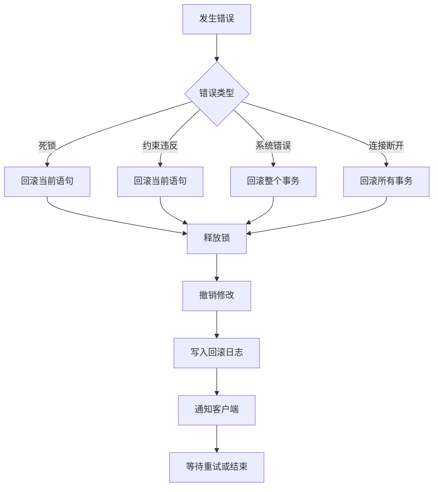
```mermaid
flowchart TD
    Error[发生错误] --> CheckType{错误类型}

    CheckType -->|死锁| AbortDeadlock[回滚当前语句]
    CheckType -->|约束违反| AbortConstraint[回滚当前语句]
    CheckType -->|系统错误| AbortSystem[回滚整个事务]
    CheckType -->|连接断开| AbortConnection[回滚所有事务]

    AbortDeadlock --> ReleaseLocks[释放锁]
    AbortConstraint --> ReleaseLocks
    AbortSystem --> ReleaseLocks
    AbortConnection --> ReleaseLocks

    ReleaseLocks --> UndoChanges[撤销修改]
    UndoChanges --> WriteAbortLog[写入回滚日志]
    WriteAbortLog --> NotifyClient[通知客户端]
    NotifyClient --> WaitRetry[等待重试或结束]
```

### 9.2 检查点恢复流程

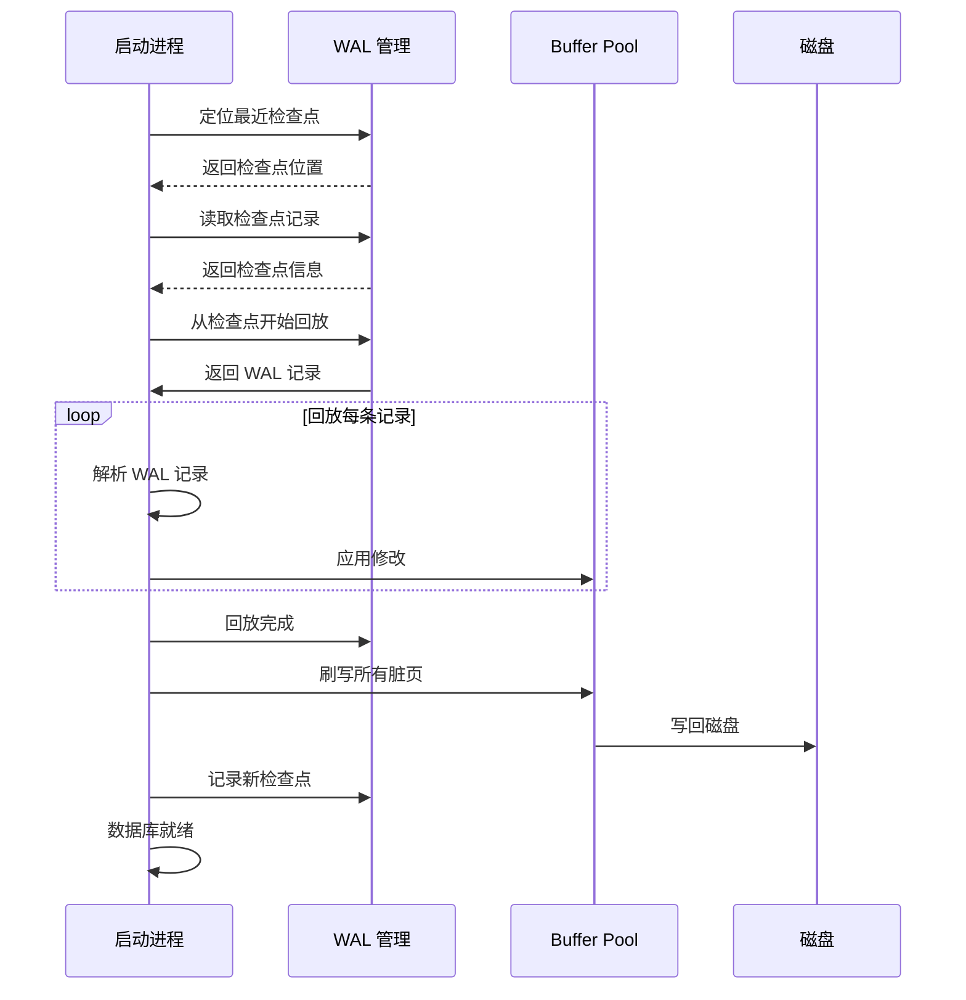
```mermaid
sequenceDiagram
    participant Startup as 启动进程
    participant WAL as WAL 管理
    participant BufPool as Buffer Pool
    participant Disk as 磁盘

    Startup->>WAL: 定位最近检查点
    WAL-->>Startup: 返回检查点位置

    Startup->>WAL: 读取检查点记录
    WAL-->>Startup: 返回检查点信息

    Startup->>WAL: 从检查点开始回放
    WAL->>Startup: 返回 WAL 记录

    loop 回放每条记录
        Startup->>Startup: 解析 WAL 记录
        Startup->>BufPool: 应用修改
    end

    Startup->>WAL: 回放完成
    Startup->>BufPool: 刷写所有脏页
    BufPool->>Disk: 写回磁盘

    Startup->>WAL: 记录新检查点
    Startup->>Startup: 数据库就绪
```

---

## 十、性能优化点

### 10.1 Buffer Pool 预读

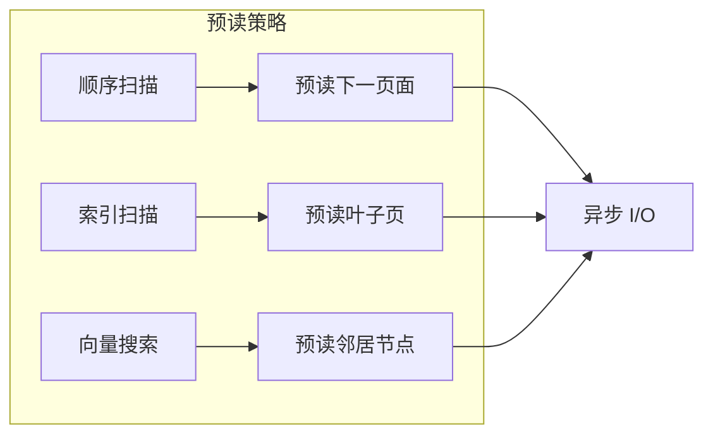
```mermaid
flowchart LR
    subgraph "预读策略"
        SequentialScan[顺序扫描] --> PrefetchNext[预读下一页面]
        IndexScan[索引扫描] --> PrefetchLeaf[预读叶子页]
        VectorSearch[向量搜索] --> PrefetchNeighbors[预读邻居节点]
    end

    PrefetchNext --> AsyncIO[异步 I/O]
    PrefetchLeaf --> AsyncIO
    PrefetchNeighbors --> AsyncIO
```

### 10.2 WAL 组提交

```mermaid
sequenceDiagram
    participant T1 as 事务1
    participant T2 as 事务2
    participant T3 as 事务3
    participant WALBuf as WAL Buffer
    participant Disk as 磁盘

    par 并发提交
        T1->>WALBuf: 写入提交记录
        T2->>WALBuf: 写入提交记录
        T3->>WALBuf: 写入提交记录
    end

    Note over WALBuf: 等待组提交窗口

    WALBuf->>Disk: 一次性刷写多个事务
    Disk-->>WALBuf: 刷写完成

    par 并发通知
        WALBuf-->>T1: 提交成功
        WALBuf-->>T2: 提交成功
        WALBuf-->>T3: 提交成功
    end
```

---

## 十一、关键代码位置

| 流程 | 相关源文件 |
|------|-----------|
| 系统启动 | `engine/src/db/core/` |
| SQL 解析 | `engine/src/db/parser/` |
| 查询优化 | `engine/src/db/optimizer/` |
| 查询执行 | `engine/src/db/executor/` |
| Buffer Pool | `engine/src/db/storage/buffer/` |
| WAL 日志 | `engine/src/db/storage/wal/` |
| 事务管理 | `engine/src/db/txn/` |
| 锁管理 | `engine/src/db/concurrency/` |
| bgworker | `engine/src/db/bgworker/` |
| Wire 协议 | `engine/include/db/sql/pgwire.h` |
