> ⚠️ **退役说明**：本文引用的 `engine/src/db/`（PostgreSQL 风格 CMake 内核）已于 **2026-11-18 退役**，源码、公开头与测试全部删除；文中出现的 `engine/src/db/...`、`engine/include/db/...`、`engine/test/db/...` 路径均为**历史路径**，现已不存在。
> 当前唯一数据库内核是 `engine/db/`。

# 多模态存储子系统 - 架构设计

## 概述

多模态存储子系统提供统一的数据存储管理，支持关系、KV、图、向量、时序、文档、空间、树等多种数据模型。通过统一的 `storage_ops_t` 接口注册机制，使各引擎能无缝集成到系统中。

---

## 一、子系统架构概览

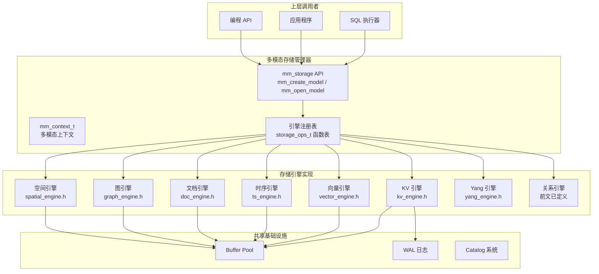
```mermaid
flowchart TB
    subgraph "多模态存储管理器"
        MM_CTX[mm_context_t<br/>多模态上下文]
        MM_API[mm_storage API<br/>mm_create_model / mm_open_model]
        ENGINE_REG[引擎注册表<br/>storage_ops_t 函数表]
    end

    subgraph "存储引擎实现"
        KV[KV 引擎<br/>kv_engine.h]
        VEC[向量引擎<br/>vector_engine.h]
        TS[时序引擎<br/>ts_engine.h]
        DOC[文档引擎<br/>doc_engine.h]
        SPATIAL[空间引擎<br/>spatial_engine.h]
        GRAPH[图引擎<br/>graph_engine.h]
        YANG[Yang 引擎<br/>yang_engine.h]
        RELATIONAL[关系引擎<br/>前文已定义]
    end

    subgraph "上层调用者"
        SQL[SQL 执行器]
        APP[应用程序]
        API[编程 API]
    end

    SQL --> MM_API
    APP --> MM_API
    API --> MM_API

    MM_API --> ENGINE_REG
    ENGINE_REG --> KV
    ENGINE_REG --> VEC
    ENGINE_REG --> TS
    ENGINE_REG --> DOC
    ENGINE_REG --> SPATIAL
    ENGINE_REG --> GRAPH
    ENGINE_REG --> YANG
    ENGINE_REG --> RELATIONAL

    subgraph "共享基础设施"
        BUF[Buffer Pool]
        WAL[WAL 日志]
        CAT[Catalog 系统]
    end

    KV --> BUF
    KV --> WAL
    VEC --> BUF
    TS --> BUF
    DOC --> BUF
    GRAPH --> BUF
    SPATIAL --> BUF
```

---

## 二、统一存储引擎接口

### 2.1 引擎接口定义

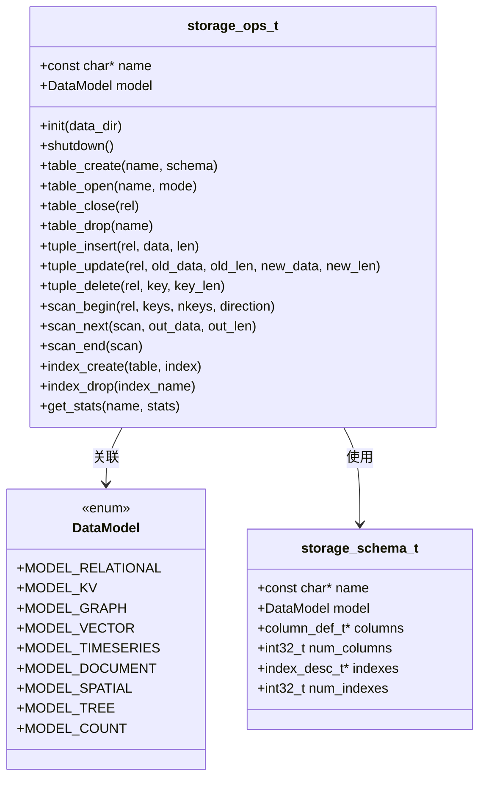
```mermaid
classDiagram
    class storage_ops_t {
        +const char* name
        +DataModel model
        +init(data_dir)
        +shutdown()
        +table_create(name, schema)
        +table_open(name, mode)
        +table_close(rel)
        +table_drop(name)
        +tuple_insert(rel, data, len)
        +tuple_update(rel, old_data, old_len, new_data, new_len)
        +tuple_delete(rel, key, key_len)
        +scan_begin(rel, keys, nkeys, direction)
        +scan_next(scan, out_data, out_len)
        +scan_end(scan)
        +index_create(table, index)
        +index_drop(index_name)
        +get_stats(name, stats)
    }

    class DataModel {
        <<enum>>
        +MODEL_RELATIONAL
        +MODEL_KV
        +MODEL_GRAPH
        +MODEL_VECTOR
        +MODEL_TIMESERIES
        +MODEL_DOCUMENT
        +MODEL_SPATIAL
        +MODEL_TREE
        +MODEL_COUNT
    }

    class storage_schema_t {
        +const char* name
        +DataModel model
        +column_def_t* columns
        +int32_t num_columns
        +index_desc_t* indexes
        +int32_t num_indexes
    }

    storage_ops_t --> DataModel : 关联
    storage_ops_t --> storage_schema_t : 使用
```

### 2.2 引擎注册与查询

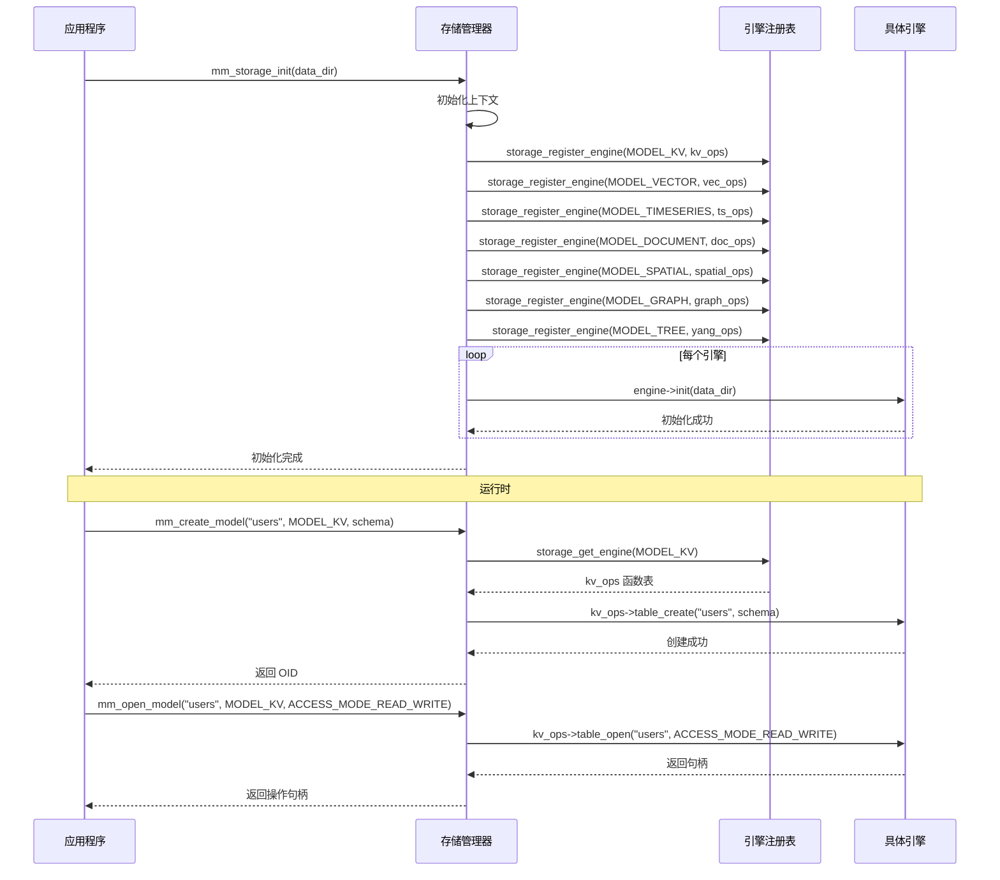
```mermaid
sequenceDiagram
    participant App as 应用程序
    participant Mgr as 存储管理器
    participant Registry as 引擎注册表
    participant Engine as 具体引擎

    App->>Mgr: mm_storage_init(data_dir)

    Mgr->>Mgr: 初始化上下文

    Mgr->>Registry: storage_register_engine(MODEL_KV, kv_ops)
    Mgr->>Registry: storage_register_engine(MODEL_VECTOR, vec_ops)
    Mgr->>Registry: storage_register_engine(MODEL_TIMESERIES, ts_ops)
    Mgr->>Registry: storage_register_engine(MODEL_DOCUMENT, doc_ops)
    Mgr->>Registry: storage_register_engine(MODEL_SPATIAL, spatial_ops)
    Mgr->>Registry: storage_register_engine(MODEL_GRAPH, graph_ops)
    Mgr->>Registry: storage_register_engine(MODEL_TREE, yang_ops)

    loop 每个引擎
        Mgr->>Engine: engine->init(data_dir)
        Engine-->>Mgr: 初始化成功
    end

    Mgr-->>App: 初始化完成

    Note over App,Engine: 运行时

    App->>Mgr: mm_create_model("users", MODEL_KV, schema)
    Mgr->>Registry: storage_get_engine(MODEL_KV)
    Registry-->>Mgr: kv_ops 函数表
    Mgr->>Engine: kv_ops->table_create("users", schema)
    Engine-->>Mgr: 创建成功
    Mgr-->>App: 返回 OID

    App->>Mgr: mm_open_model("users", MODEL_KV, ACCESS_MODE_READ_WRITE)
    Mgr->>Engine: kv_ops->table_open("users", ACCESS_MODE_READ_WRITE)
    Engine-->>Mgr: 返回句柄
    Mgr-->>App: 返回操作句柄
```

---

## 三、KV 引擎

### 3.1 KV 引擎架构

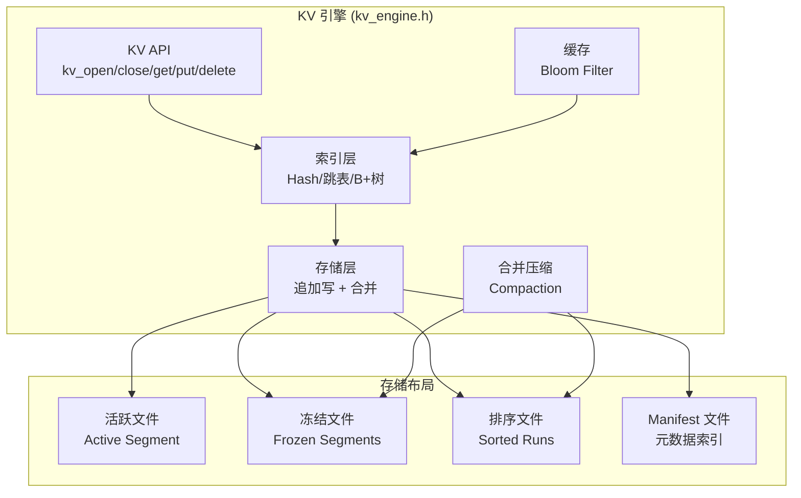
```mermaid
flowchart TB
    subgraph "KV 引擎 (kv_engine.h)"
        KV_API[KV API<br/>kv_open/close/get/put/delete]

        INDEX[索引层<br/>Hash/跳表/B+树]
        STORAGE[存储层<br/>追加写 + 合并]

        COMPACT[合并压缩<br/>Compaction]
        CACHE[缓存<br/>Bloom Filter]
    end

    subgraph "存储布局"
        ACTIVE[活跃文件<br/>Active Segment]
        FROZEN[冻结文件<br/>Frozen Segments]
        SORTED[排序文件<br/>Sorted Runs]
        MANIFEST[Manifest 文件<br/>元数据索引]
    end

    KV_API --> INDEX
    INDEX --> STORAGE
    STORAGE --> ACTIVE
    STORAGE --> FROZEN
    STORAGE --> SORTED
    STORAGE --> MANIFEST
    COMPACT --> FROZEN
    COMPACT --> SORTED
    CACHE --> INDEX
```

### 3.2 KV 引擎操作流程

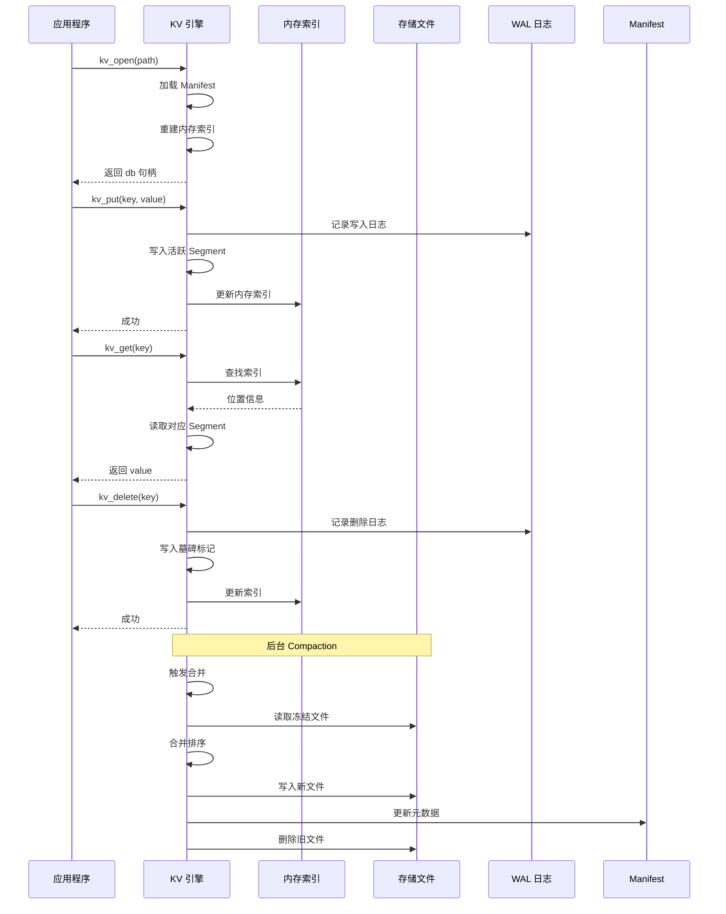
```mermaid
sequenceDiagram
    participant App as 应用程序
    participant KV as KV 引擎
    participant Index as 内存索引
    participant Flie as 存储文件
    participant WAL as WAL 日志

    App->>KV: kv_open(path)
    KV->>KV: 加载 Manifest
    KV->>KV: 重建内存索引
    KV-->>App: 返回 db 句柄

    App->>KV: kv_put(key, value)
    KV->>WAL: 记录写入日志
    KV->>KV: 写入活跃 Segment
    KV->>Index: 更新内存索引
    KV-->>App: 成功

    App->>KV: kv_get(key)
    KV->>Index: 查找索引
    Index-->>KV: 位置信息
    KV->>KV: 读取对应 Segment
    KV-->>App: 返回 value

    App->>KV: kv_delete(key)
    KV->>WAL: 记录删除日志
    KV->>KV: 写入墓碑标记
    KV->>Index: 更新索引
    KV-->>App: 成功

    Note over KV,Flie: 后台 Compaction

    KV->>KV: 触发合并
    KV->>Flie: 读取冻结文件
    KV->>KV: 合并排序
    KV->>Flie: 写入新文件
    KV->>Manifest: 更新元数据
    KV->>Flie: 删除旧文件
```

---

## 四、向量引擎

### 4.1 向量引擎架构

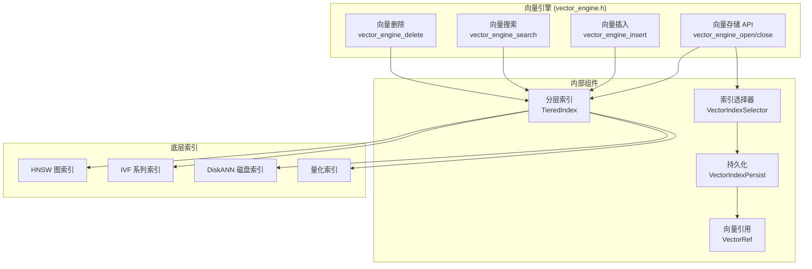
```mermaid
flowchart TB
    subgraph "向量引擎 (vector_engine.h)"
        VEC_API[向量存储 API<br/>vector_engine_open/close]
        VEC_INSERT[向量插入<br/>vector_engine_insert]
        VEC_SEARCH[向量搜索<br/>vector_engine_search]
        VEC_DELETE[向量删除<br/>vector_engine_delete]
    end

    subgraph "内部组件"
        INDEX_SEL[索引选择器<br/>VectorIndexSelector]
        TIERED[分层索引<br/>TieredIndex]
        PERSIST[持久化<br/>VectorIndexPersist]
        VEC_REF[向量引用<br/>VectorRef]
    end

    subgraph "底层索引"
        HNSW[HNSW 图索引]
        IVF[IVF 系列索引]
        DISKANN[DiskANN 磁盘索引]
        PQ[量化索引]
    end

    VEC_API --> INDEX_SEL
    VEC_API --> TIERED
    VEC_INSERT --> TIERED
    VEC_SEARCH --> TIERED
    VEC_DELETE --> TIERED
    TIERED --> HNSW
    TIERED --> IVF
    TIERED --> DISKANN
    TIERED --> PQ
    INDEX_SEL --> PERSIST
    PERSIST --> VEC_REF
```

### 4.2 向量搜索流程

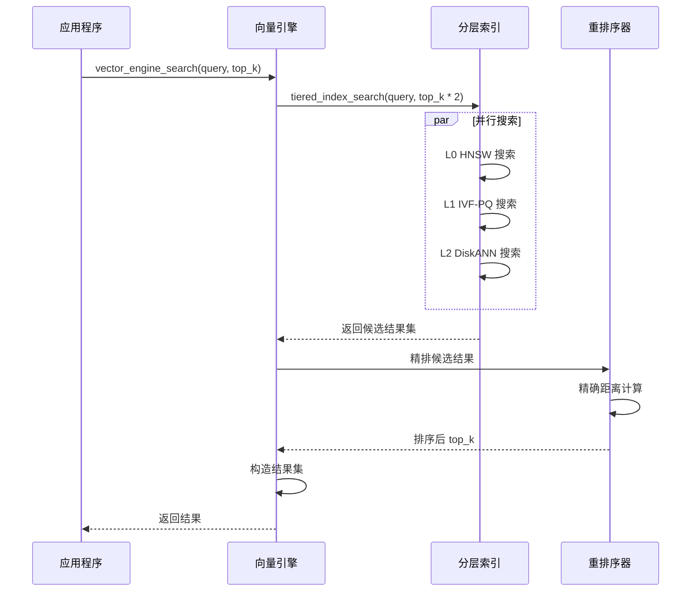
```mermaid
sequenceDiagram
    participant App as 应用程序
    participant VEC as 向量引擎
    participant TIERED as 分层索引
    participant RERANK as 重排序器

    App->>VEC: vector_engine_search(query, top_k)

    VEC->>TIERED: tiered_index_search(query, top_k * 2)

    par 并行搜索
        TIERED->>TIERED: L0 HNSW 搜索
        TIERED->>TIERED: L1 IVF-PQ 搜索
        TIERED->>TIERED: L2 DiskANN 搜索
    end

    TIERED-->>VEC: 返回候选结果集

    VEC->>RERANK: 精排候选结果
    RERANK->>RERANK: 精确距离计算
    RERANK-->>VEC: 排序后 top_k

    VEC->>VEC: 构造结果集
    VEC-->>App: 返回结果
```

---

## 五、时序引擎

### 5.1 时序引擎架构

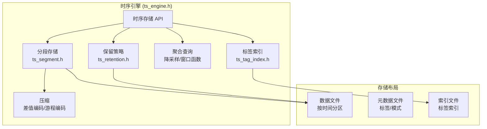
```mermaid
flowchart TB
    subgraph "时序引擎 (ts_engine.h)"
        TS_API[时序存储 API]
        SEGMENT[分段存储<br/>ts_segment.h]
        RETENTION[保留策略<br/>ts_retention.h]
        COMPRESS[压缩<br/>差值编码/游程编码]
        AGG[聚合查询<br/>降采样/窗口函数]
        TAG_IDX[标签索引<br/>ts_tag_index.h]
    end

    subgraph "存储布局"
        TS_DATA[数据文件<br/>按时间分区]
        TS_META[元数据文件<br/>标签/模式]
        TS_INDEX[索引文件<br/>标签索引]
    end

    TS_API --> SEGMENT
    TS_API --> RETENTION
    TS_API --> AGG
    SEGMENT --> COMPRESS
    SEGMENT --> TS_DATA
    TS_API --> TAG_IDX
    TAG_IDX --> TS_INDEX
    RETENTION --> TS_DATA
```

### 5.2 时序数据写入流程

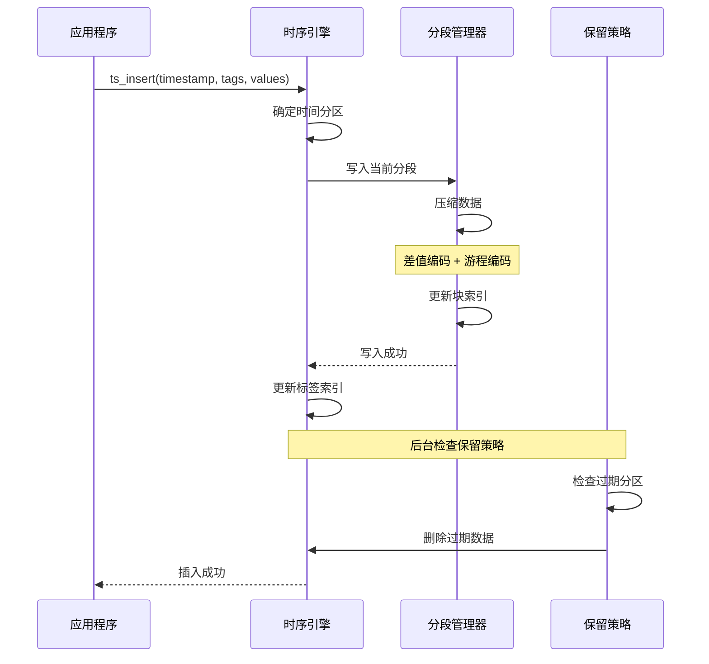
```mermaid
sequenceDiagram
    participant App as 应用程序
    participant TS as 时序引擎
    participant Segment as 分段管理器
    participant Retention as 保留策略

    App->>TS: ts_insert(timestamp, tags, values)

    TS->>TS: 确定时间分区
    TS->>Segment: 写入当前分段

    Segment->>Segment: 压缩数据
    Note over Segment: 差值编码 + 游程编码

    Segment->>Segment: 更新块索引
    Segment-->>TS: 写入成功

    TS->>TS: 更新标签索引

    Note over TS,Retention: 后台检查保留策略

    Retention->>Retention: 检查过期分区
    Retention->>TS: 删除过期数据
    TS-->>App: 插入成功
```

### 5.3 时序数据聚合查询

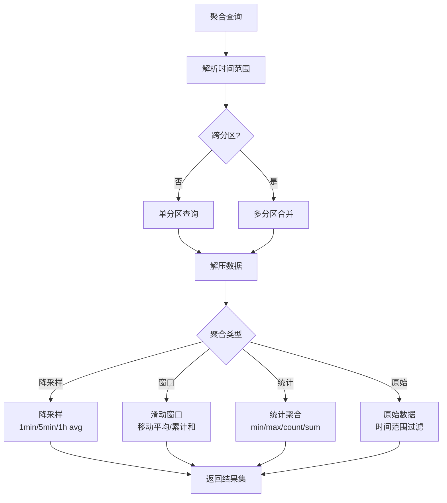
```mermaid
flowchart TD
    Start[聚合查询] --> ParseTimeRange[解析时间范围]

    ParseTimeRange --> CheckPartition{跨分区?}

    CheckPartition -->|否| SinglePart[单分区查询]
    CheckPartition -->|是| MultiPart[多分区合并]

    SinglePart --> Decompress[解压数据]
    MultiPart --> Decompress

    Decompress --> Aggregate{聚合类型}

    Aggregate -->|降采样| Downsample[降采样<br/>1min/5min/1h avg]
    Aggregate -->|窗口| Window[滑动窗口<br/>移动平均/累计和]
    Aggregate -->|统计| Stats[统计聚合<br/>min/max/count/sum]
    Aggregate -->|原始| Raw[原始数据<br/>时间范围过滤]

    Downsample --> Result
    Window --> Result
    Stats --> Result
    Raw --> Result

    Result[返回结果集]
```

---

## 六、文档引擎

### 6.1 文档引擎架构

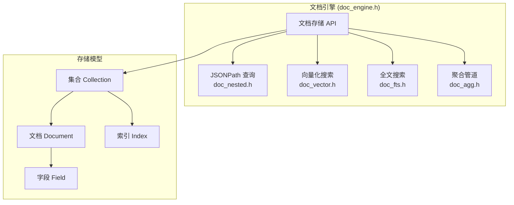
```mermaid
flowchart TB
    subgraph "文档引擎 (doc_engine.h)"
        DOC_API[文档存储 API]
        DOC_JSON[JSONPath 查询<br/>doc_nested.h]
        DOC_VEC[向量化搜索<br/>doc_vector.h]
        DOC_FTS[全文搜索<br/>doc_fts.h]
        DOC_AGG[聚合管道<br/>doc_agg.h]
    end

    subgraph "存储模型"
        COLLECTION[集合 Collection]
        DOCUMENT[文档 Document]
        FIELD[字段 Field]
        INDEX[索引 Index]
    end

    DOC_API --> COLLECTION
    DOC_API --> DOC_JSON
    DOC_API --> DOC_VEC
    DOC_API --> DOC_FTS
    DOC_API --> DOC_AGG
    COLLECTION --> DOCUMENT
    DOCUMENT --> FIELD
    COLLECTION --> INDEX
```

### 6.2 文档查询流程

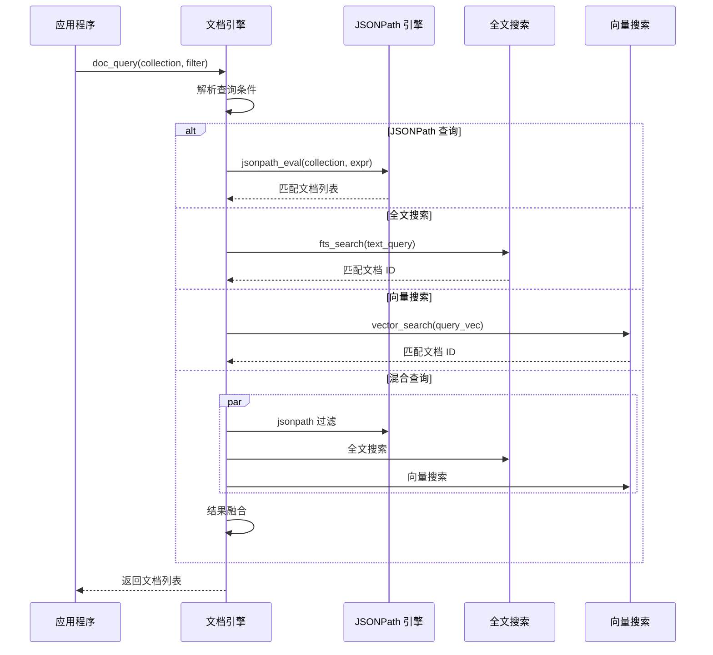
```mermaid
sequenceDiagram
    participant App as 应用程序
    participant DOC as 文档引擎
    participant JSON as JSONPath 引擎
    participant FTS as 全文搜索
    participant VEC as 向量搜索

    App->>DOC: doc_query(collection, filter)

    DOC->>DOC: 解析查询条件

    alt JSONPath 查询
        DOC->>JSON: jsonpath_eval(collection, expr)
        JSON-->>DOC: 匹配文档列表
    else 全文搜索
        DOC->>FTS: fts_search(text_query)
        FTS-->>DOC: 匹配文档 ID
    else 向量搜索
        DOC->>VEC: vector_search(query_vec)
        VEC-->>DOC: 匹配文档 ID
    else 混合查询
        par
            DOC->>JSON: jsonpath 过滤
            DOC->>FTS: 全文搜索
            DOC->>VEC: 向量搜索
        end
        DOC->>DOC: 结果融合
    end

    DOC-->>App: 返回文档列表
```

---

## 七、空间引擎

### 7.1 空间引擎架构

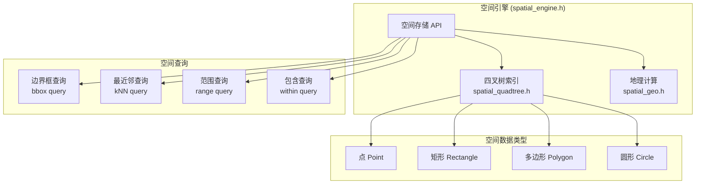
```mermaid
flowchart TB
    subgraph "空间引擎 (spatial_engine.h)"
        SPATIAL_API[空间存储 API]
        QUADTREE[四叉树索引<br/>spatial_quadtree.h]
        GEO[地理计算<br/>spatial_geo.h]
    end

    subgraph "空间数据类型"
        POINT[点 Point]
        RECT[矩形 Rectangle]
        POLYGON[多边形 Polygon]
        CIRCLE[圆形 Circle]
    end

    subgraph "空间查询"
        BB[边界框查询<br/>bbox query]
        NEAR[最近邻查询<br/>kNN query]
        RANGE[范围查询<br/>range query]
        WITHIN[包含查询<br/>within query]
    end

    SPATIAL_API --> QUADTREE
    SPATIAL_API --> GEO
    QUADTREE --> POINT
    QUADTREE --> RECT
    QUADTREE --> POLYGON
    QUADTREE --> CIRCLE
    SPATIAL_API --> BB
    SPATIAL_API --> NEAR
    SPATIAL_API --> RANGE
    SPATIAL_API --> WITHIN
```

### 7.2 空间四叉树索引

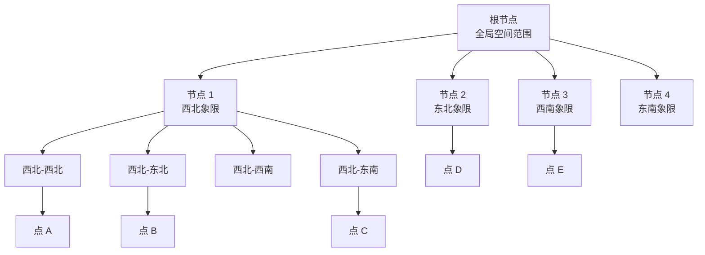
```mermaid
flowchart TB
    ROOT[根节点<br/>全局空间范围]
    N1[节点 1<br/>西北象限]
    N2[节点 2<br/>东北象限]
    N3[节点 3<br/>西南象限]
    N4[节点 4<br/>东南象限]

    N11[西北-西北]
    N12[西北-东北]
    N13[西北-西南]
    N14[西北-东南]

    ROOT --> N1
    ROOT --> N2
    ROOT --> N3
    ROOT --> N4

    N1 --> N11
    N1 --> N12
    N1 --> N13
    N1 --> N14

    N11 --> P1[点 A]
    N12 --> P2[点 B]
    N14 --> P3[点 C]
    N2 --> P4[点 D]
    N3 --> P5[点 E]
```

---

## 八、图引擎

### 8.1 图引擎架构

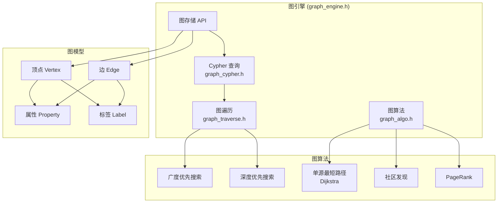
```mermaid
flowchart TB
    subgraph "图引擎 (graph_engine.h)"
        GRAPH_API[图存储 API]
        CYPHER[Cypher 查询<br/>graph_cypher.h]
        ALGO[图算法<br/>graph_algo.h]
        TRAVERSE[图遍历<br/>graph_traverse.h]
    end

    subgraph "图模型"
        VERTEX[顶点 Vertex]
        EDGE[边 Edge]
        PROPERTY[属性 Property]
        LABEL[标签 Label]
    end

    subgraph "图算法"
        BFS[广度优先搜索]
        DFS[深度优先搜索]
        SSSP[单源最短路径<br/>Dijkstra]
        COMMUNITY[社区发现]
        PAGE_RANK[PageRank]
    end

    GRAPH_API --> VERTEX
    GRAPH_API --> EDGE
    GRAPH_API --> CYPHER
    CYPHER --> TRAVERSE
    TRAVERSE --> BFS
    TRAVERSE --> DFS
    ALGO --> SSSP
    ALGO --> COMMUNITY
    ALGO --> PAGE_RANK
    VERTEX --> PROPERTY
    VERTEX --> LABEL
    EDGE --> PROPERTY
    EDGE --> LABEL
```

### 8.2 图遍历流程

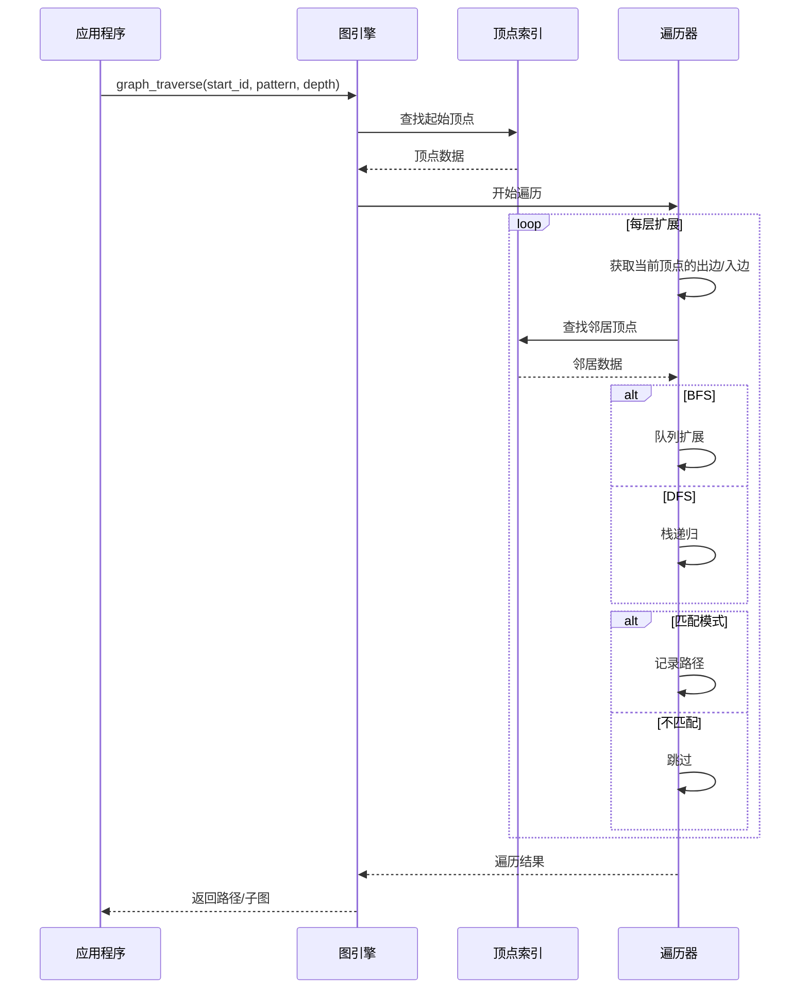
```mermaid
sequenceDiagram
    participant App as 应用程序
    participant GRAPH as 图引擎
    participant Index as 顶点索引
    participant Traverse as 遍历器

    App->>GRAPH: graph_traverse(start_id, pattern, depth)

    GRAPH->>Index: 查找起始顶点
    Index-->>GRAPH: 顶点数据

    GRAPH->>Traverse: 开始遍历

    loop 每层扩展
        Traverse->>Traverse: 获取当前顶点的出边/入边
        Traverse->>Index: 查找邻居顶点
        Index-->>Traverse: 邻居数据

        alt BFS
            Traverse->>Traverse: 队列扩展
        else DFS
            Traverse->>Traverse: 栈递归
        end

        alt 匹配模式
            Traverse->>Traverse: 记录路径
        else 不匹配
            Traverse->>Traverse: 跳过
        end
    end

    Traverse-->>GRAPH: 遍历结果
    GRAPH-->>App: 返回路径/子图
```

---

## 九、Yang 引擎

### 9.1 Yang 引擎架构

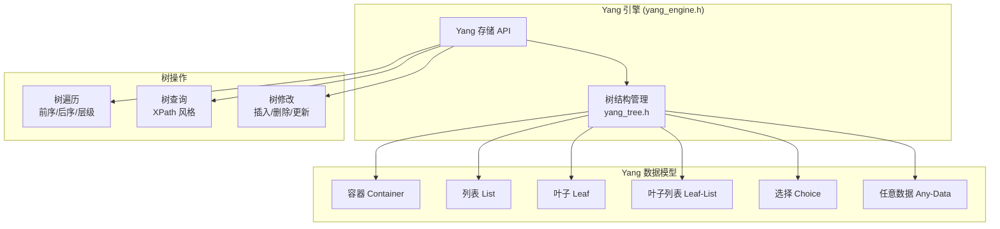
```mermaid
flowchart TB
    subgraph "Yang 引擎 (yang_engine.h)"
        YANG_API[Yang 存储 API]
        YANG_TREE[树结构管理<br/>yang_tree.h]
    end

    subgraph "Yang 数据模型"
        CONTAINER[容器 Container]
        LIST[列表 List]
        LEAF[叶子 Leaf]
        LEAF_LIST[叶子列表 Leaf-List]
        CHOICE[选择 Choice]
        ANY_DATA[任意数据 Any-Data]
    end

    subgraph "树操作"
        TRAVERSAL[树遍历<br/>前序/后序/层级]
        QUERY[树查询<br/>XPath 风格]
        MODIFY[树修改<br/>插入/删除/更新]
    end

    YANG_API --> YANG_TREE
    YANG_TREE --> CONTAINER
    YANG_TREE --> LIST
    YANG_TREE --> LEAF
    YANG_TREE --> LEAF_LIST
    YANG_TREE --> CHOICE
    YANG_TREE --> ANY_DATA
    YANG_API --> TRAVERSAL
    YANG_API --> QUERY
    YANG_API --> MODIFY
```

---

## 十、引擎注册与管理

### 10.1 引擎生命周期

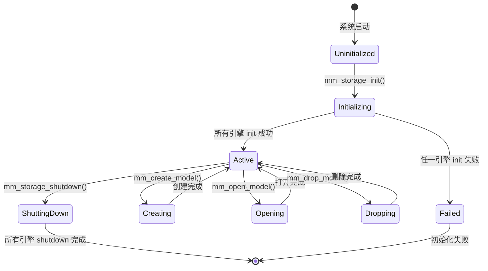
```mermaid
stateDiagram-v2
    [*] --> Uninitialized: 系统启动

    Uninitialized --> Initializing: mm_storage_init()
    Initializing --> Active: 所有引擎 init 成功
    Initializing --> Failed: 任一引擎 init 失败

    Active --> Creating: mm_create_model()
    Creating --> Active: 创建完成

    Active --> Opening: mm_open_model()
    Opening --> Active: 打开完成

    Active --> Dropping: mm_drop_model()
    Dropping --> Active: 删除完成

    Active --> ShuttingDown: mm_storage_shutdown()
    ShuttingDown --> [*]: 所有引擎 shutdown 完成

    Failed --> [*]: 初始化失败
```

### 10.2 统计算计

| 数据模型 | 引擎入口 | 统计指标 |
|---------|---------|---------|
| KV | `kv_engine.h` | 键数量、存储大小、Compaction 次数 |
| 向量 | `vector_engine.h` | 向量数、维度、搜索延迟、命中率 |
| 时序 | `ts_engine.h` | 序列数、数据点、保留策略 |
| 文档 | `doc_engine.h` | 文档数、索引大小、查询延迟 |
| 空间 | `spatial_engine.h` | 空间对象数、四叉树深度 |
| 图 | `graph_engine.h` | 顶点/边数、平均度数 |
| Yang | `yang_engine.h` | 树节点数、树深度 |

---

## 十一、关键代码位置

| 功能 | 头文件 | 源文件 |
|------|--------|--------|
| 多模态管理器 | `engine/include/db/mm_storage.h` | `engine/src/db/mm_storage/` |
| 存储引擎接口 | `engine/include/db/storage_engine.h` | `engine/src/db/` |
| KV 引擎 | `engine/include/db/kv_engine.h` | `engine/src/db/storage/kv/` |
| 向量引擎 | `engine/include/db/vector_engine.h` | `engine/src/db/storage/vector/` |
| 时序引擎 | `engine/include/db/ts_engine.h` | `engine/src/db/storage/ts/` |
| 文档引擎 | `engine/include/db/doc_engine.h` | `engine/src/db/storage/doc/` |
| 空间引擎 | `engine/include/db/spatial_engine.h` | `engine/src/db/storage/spatial/` |
| 图引擎 | `engine/include/db/graph_engine.h` | `engine/src/db/storage/graph/` |
| Yang 引擎 | `engine/include/db/yang_engine.h` | `engine/src/db/storage/yang/` |